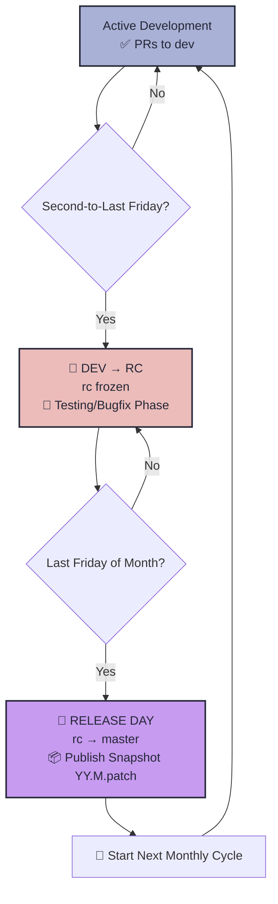
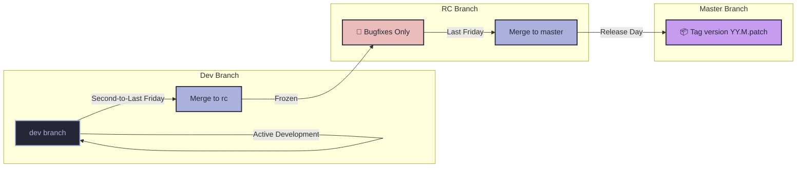

# Branch & Release Policy — Predictive Monthly Releases

[Jump to Calendar](#monthly-release-calendar-2026)

#### Key Points

1. **Development** — All active development and Pull Requests (PRs) target the `dev` branch.
2. **Freeze Week** — On the **second-to-last Friday of each month**, `dev` is merged into `rc` (release-candidate), which is then *frozen* for testing and bugfixes only.
3. **Release Day** — On the **last Friday of each month**, the stabilized `rc` branch is merged into `master` and the official release is published.
4. **Snapshots** — Official Snapshots are published directly from `master` on Release Day.
5. **Predictive Cadence** — A simple monthly rhythm: active development all month until the second-to-last Friday, followed by exactly **one week of testing/freeze**, ending with the release on the last Friday.

> [!NOTE]
> The `dev` branch is always open for new features and development *every* week. Only the `rc` branch is frozen for stabilization during the testing period.

---

## Weekly Breakdown (Monthly Cycle)

| Phase | `dev` Status | `rc` Status | Allowed Changes | Description |
| :--- | :--- | :--- | :--- | :--- |
| **Active Development** (Start of month to Second-to-Last Friday) | ✅ **OPEN** | ✅ **OPEN** | ✅ All development goes to `dev` and merges to `rc` | General development and new feature implementation. |
| **Freeze Period** (Second-to-Last to Last Friday) | ✅ **OPEN** | 🚫 **FROZEN** | ❌ No new features on `rc`<br/>✅ Bugfixes only on `rc` | Exactly **1 week** of regression testing and stability improvements. |
| **Release Day** (Last Friday) | ✅ **OPEN** | 🔄 **MERGING** | 🔄 Merge `rc` → `master` and create release tag | Official monthly Snapshot deployment. |

---

## Versioning: YY.M.patch

We use a **year.month.patch** (`YY.M.patch`) format for our monthly releases:

- **Temporal clarity:** Instantly shows the year and month of the release (e.g., `26.5.0` is the May 2026 release).
- **Patch component:** Starts at `.0` for each monthly release. Increments only for hotfixes applied between releases (e.g., `26.5.1` for a hotfix after the May release).
- **Predictable:** Faithfully follows the calendar month.

---

## Pull Requests

- **Must** target the `dev` branch.
- Must be reviewed and approved by at least one other developer before merging.
- Can be created at any time, but must merge into `dev` before Freeze Day to be included in that month's release.

---

# Flow Diagrams

## Monthly Branch Lifecycle



## Branch Flow Structure



---

# Monthly Release Calendar — 2026

| Month | Freeze Friday (Second-to-Last) | Release Friday (Last) | Tag |
| :--- | :--- | :--- | :--- |
| **Jan** | 2026-01-23 | 2026-01-30 | 26.1.0 |
| **Feb** | 2026-02-20 | 2026-02-27 | 26.2.0 |
| **Mar** | 2026-03-20 | 2026-03-27 | 26.3.0 |
| **Apr** | 2026-04-17 | 2026-04-24 | 26.4.0 |
| **May** | 2026-05-22 | 2026-05-29 | 26.5.0 |
| **Jun** | 2026-06-19 | 2026-06-26 | 26.6.0 |
| **Jul** | 2026-07-24 | 2026-07-31 | 26.7.0 |
| **Aug** | 2026-08-21 | 2026-08-28 | 26.8.0 |
| **Sep** | 2026-09-18 | 2026-09-25 | 26.9.0 |
| **Oct** | 2026-10-23 | 2026-10-30 | 26.10.0 |
| **Nov** | 2026-11-20 | 2026-11-27 | 26.11.0 |
| **Dec** | 2026-12-18 | 2026-12-25 🎄 | 26.12.0 |

---

## Step-by-Step Monthly Guide — Branch State (May – December 2026)

This section details exactly what happens to each branch every Friday under the second-to-last-Friday freeze and last-Friday release policy.

```
master branch ───► Receives stable code from rc on the Last Friday of the month (Release Day)
dev branch    ───► Always open for active development
rc branch     ───► Frozen on the Second-to-Last Friday, released on the Last Friday
```

---

### MAY 2026

#### Fridays May 1, 8, and 15 — Active Development
*   **dev**: Open. All development and PRs go here.
*   **rc**: Open.
*   **master**: Stable (previous release).

#### 🚫 Friday May 22 (Second-to-Last Friday) — Freeze Day
*   **Action**: Merge `dev` → `rc`.
*   **`rc` state**: **FROZEN**. Only patches and bugfixes allowed for version `26.5.0` during this testing week.

#### 🚀 Friday May 29 (Last Friday) — Release Day
*   **Action**: Merge `rc` → `master` and officially publish version **`26.5.0`**.

---

### JUNE 2026

#### Fridays June 5 and 12 — Active Development
*   **dev**: Open. Normal development and PRs.
*   **rc**: Open.

#### 🚫 Friday June 19 (Second-to-Last Friday) — Freeze Day
*   **Action**: Merge `dev` → `rc`.
*   **`rc` state**: **FROZEN**. Only bugfixes allowed for version `26.6.0` during this testing week.

#### 🚀 Friday June 26 (Last Friday) — Release Day
*   **Action**: Merge `rc` → `master` and officially publish version **`26.6.0`**.

---

### JULY 2026

#### Fridays July 3, 10, and 17 — Active Development
*   **dev**: Open. Normal development and PRs.
*   **rc**: Open.

#### 🚫 Friday July 24 (Second-to-Last Friday) — Freeze Day
*   **Action**: Merge `dev` → `rc`.
*   **`rc` state**: **FROZEN**. Only bugfixes allowed for version `26.7.0` during this testing week.

#### 🚀 Friday July 31 (Last Friday) — Release Day
*   **Action**: Merge `rc` → `master` and officially publish version **`26.7.0`**.

---

### AUGUST 2026

#### Fridays August 7 and 14 — Active Development
*   **dev**: Open. Normal development and PRs.
*   **rc**: Open.

#### 🚫 Friday August 21 (Second-to-Last Friday) — Freeze Day
*   **Action**: Merge `dev` → `rc`.
*   **`rc` state**: **FROZEN**. Only bugfixes allowed for version `26.8.0` during this testing week.

#### 🚀 Friday August 28 (Last Friday) — Release Day
*   **Action**: Merge `rc` → `master` and officially publish version **`26.8.0`**.

---

### SEPTEMBER 2026

#### Fridays September 4 and 11 — Active Development
*   **dev**: Open. Normal development and PRs.
*   **rc**: Open.

#### 🚫 Friday September 18 (Second-to-Last Friday) — Freeze Day
*   **Action**: Merge `dev` → `rc`.
*   **`rc` state**: **FROZEN**. Only bugfixes allowed for version `26.9.0` during this testing week.

#### 🚀 Friday September 25 (Last Friday) — Release Day
*   **Action**: Merge `rc` → `master` and officially publish version **`26.9.0`**.

---

### OCTOBER 2026

#### Fridays October 2, 9, and 16 — Active Development
*   **dev**: Open. Normal development and PRs.
*   **rc**: Open.

#### 🚫 Friday October 23 (Second-to-Last Friday) — Freeze Day
*   **Action**: Merge `dev` → `rc`.
*   **`rc` state**: **FROZEN**. Only bugfixes allowed for version `26.10.0` during this testing week.

#### 🚀 Friday October 30 (Last Friday) — Release Day
*   **Action**: Merge `rc` → `master` and officially publish version **`26.10.0`**.

---

### NOVEMBER 2026

#### Fridays November 6 and 13 — Active Development
*   **dev**: Open. Normal development and PRs.
*   **rc**: Open.

#### 🚫 Friday November 20 (Second-to-Last Friday) — Freeze Day
*   **Action**: Merge `dev` → `rc`.
*   **`rc` state**: **FROZEN**. Only bugfixes allowed for version `26.11.0` during this testing week.

#### 🚀 Friday November 27 (Last Friday) — Release Day
*   **Action**: Merge `rc` → `master` and officially publish version **`26.11.0`**.

---

### DECEMBER 2026

#### Fridays December 4 and 11 — Active Development
*   **dev**: Open. Normal development and PRs.
*   **rc**: Open.

#### 🚫 Friday December 18 (Second-to-Last Friday) — Freeze Day
*   **Action**: Merge `dev` → `rc`.
*   **`rc` state**: **FROZEN**. Only bugfixes allowed for version `26.12.0` during this testing week.

#### 🚀 Friday December 25 (Last Friday) — Release Day 🎄
*   **Action**: Merge `rc` → `master` and officially publish version **`26.12.0`** (final release of the year).
